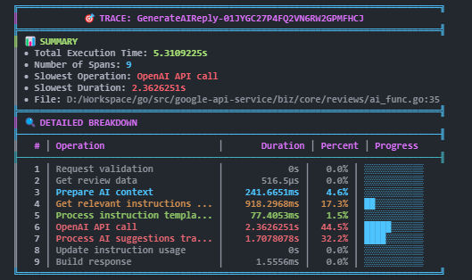
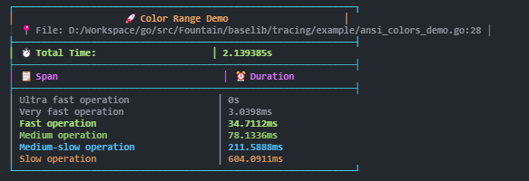
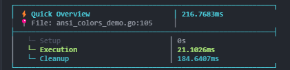
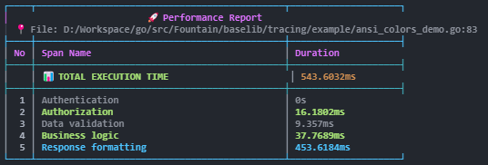
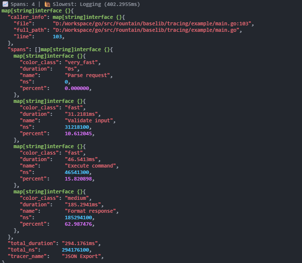

# 🚀 QuickTrace

<div align="center">



**A high-performance, multi-language tracing library with beautiful colored output**

[](https://github.com/LeDuyViet/quicktrace/releases)
[](https://golang.org/)
[](https://nodejs.org/)
[](https://openjdk.java.net/)
[](https://swift.org/)
[](https://dotnet.microsoft.com/)
[](https://dart.dev/)

[](https://opensource.org/licenses/MIT)
[](https://github.com/LeDuyViet/quicktrace/stargazers)
[](https://github.com/LeDuyViet/quicktrace/network/members)
[](https://github.com/LeDuyViet/quicktrace/issues)
[](https://github.com/LeDuyViet/quicktrace/pulls)

[](https://github.com/LeDuyViet/quicktrace/actions)
[](https://www.codefactor.io/repository/github/leduyViet/quicktrace)
[](https://codeclimate.com/github/LeDuyViet/quicktrace/maintainability)

[📖 Documentation](https://github.com/LeDuyViet/quicktrace/wiki) |
[🚀 Quick Start](#-quick-start) |
[💬 Discord](https://discord.gg/quicktrace) |
[🐛 Report Bug](https://github.com/LeDuyViet/quicktrace/issues) |
[✨ Request Feature](https://github.com/LeDuyViet/quicktrace/issues)

</div>

---

## 📋 Table of Contents

- [🚀 QuickTrace](#-quicktrace)
  - [📋 Table of Contents](#-table-of-contents)
  - [🌟 Overview](#-overview)
  - [✨ Features](#-features)
    - [🎯 **Core Features**](#-core-features)
    - [🌍 **Multi-Language Support**](#-multi-language-support)
    - [🎛️ **Advanced Features**](#️-advanced-features)
    - [🛡️ **Production Ready**](#️-production-ready)
  - [📦 Installation](#-installation)
  - [🚀 Quick Start](#-quick-start)
    - [🟢 **Go**](#-go)
    - [🟡 **JavaScript**](#-javascript)
  - [🎨 Output Styles](#-output-styles)
    - [🎯 **StyleColorful**](#-stylecolorful)
    - [📄 **StyleDefault**](#-styledefault)
    - [🌲 **StyleMinimal**](#-styleminimal)
    - [📊 **StyleDetailed**](#-styledetailed)
    - [📋 **StyleTable**](#-styletable)
    - [🔧 **StyleJSON**](#-stylejson)
  - [🌍 Language Support](#-language-support)
  - [⚡ Performance](#-performance)
    - [📊 **Benchmarks**](#-benchmarks)
    - [🎯 **Optimizations**](#-optimizations)
    - [🔍 **Smart Filtering Performance**](#-smart-filtering-performance)
    - [📈 **Scaling**](#-scaling)
  - [⚙️ Advanced Usage](#️-advanced-usage)
    - [🟢 Go](#-go-1)
    - [🟡 JavaScript](#-javascript-1)
    - [Runtime Style Changes](#runtime-style-changes)
    - [Color Customization](#color-customization)
    - [JSON Export](#json-export)
    - [Integration with Monitoring Systems](#integration-with-monitoring-systems)
  - [🎯 API Reference](#-api-reference)
    - [Tracer Creation](#tracer-creation)
    - [Span Management](#span-management)
    - [Configuration](#configuration)
    - [Data Access](#data-access)
  - [📁 Examples](#-examples)
    - [🟢 **Go Examples**](#-go-examples)
    - [🟡 **JavaScript Examples**](#-javascript-examples)
    - [☕ **Java Examples**](#-java-examples)
    - [🟣 **C# Examples**](#-c-examples)
    - [🟠 **Swift Examples**](#-swift-examples)
    - [🎯 **Dart Examples**](#-dart-examples)
  - [🤝 Contributing](#-contributing)
  - [🗺️ Roadmap](#️-roadmap)
    - [Version 2.0](#version-20)
    - [Version 2.1](#version-21)
  - [❓ FAQ](#-faq)
    - [**Q: Is QuickTrace suitable for production use?**](#q-is-quicktrace-suitable-for-production-use)
    - [**Q: Does QuickTrace work in CI/CD environments?**](#q-does-quicktrace-work-in-cicd-environments)
    - [**Q: Can I use QuickTrace with existing logging libraries?**](#q-can-i-use-quicktrace-with-existing-logging-libraries)
    - [**Q: How do I contribute a new language implementation?**](#q-how-do-i-contribute-a-new-language-implementation)
    - [**Q: Is there a performance impact in production?**](#q-is-there-a-performance-impact-in-production)
  - [🆘 Support](#-support)
  - [🔒 Security](#-security)
  - [📝 License](#-license)
  - [🙏 Acknowledgments](#-acknowledgments)

## 🌟 Overview

QuickTrace is a lightweight, high-performance tracing library designed for modern development workflows. It provides beautiful, colored output with cross-platform compatibility and smart filtering capabilities across **6 programming languages**.

Perfect for debugging, performance monitoring, and understanding complex application flows with minimal overhead and zero configuration required.



*Example of StyleColorful output showing performance tracing with color-coded timing*

## ✨ Features

<table>
<tr>
<td width="50%">

### 🎯 **Core Features**
- 🎨 **Cross-platform colors** - Windows, Linux, macOS compatible
- ⚡ **Zero configuration** - Works out of the box
- 📊 **6 beautiful output styles** - From minimal to detailed
- 🔍 **Smart filtering** - Hide noise, focus on what matters
- 📍 **Automatic caller info** - File and line tracking
- 🚀 **High performance** - Minimal overhead design

</td>
<td width="50%">

### 🌍 **Multi-Language Support**
- 🟢 **Go** - Native performance
- 🟡 **JavaScript/Node.js** - Universal compatibility  
- ☕ **Java** - Enterprise ready
- 🟠 **Swift** - iOS/macOS native
- 🟣 **C#/.NET** - Cross-platform
- 🎯 **Dart/Flutter** - Mobile & web

</td>
</tr>
<tr>
<td width="50%">

### 🎛️ **Advanced Features**
- 🎚️ **Runtime control** - Enable/disable dynamically
- 📈 **Performance analysis** - Built-in statistics
- 🎨 **Custom styling** - Flexible theming
- 🔄 **JSON export** - Data integration ready
- 🧠 **Smart grouping** - Similar operations clustering

</td>
<td width="50%">

### 🛡️ **Production Ready**
- 🔒 **Thread-safe** - Concurrent execution
- 💾 **Memory efficient** - Smart buffering
- 🚫 **Zero dependencies** - Minimal footprint
- 📝 **Comprehensive docs** - Full API coverage
- 🧪 **Well tested** - High code coverage

</td>
</tr>
</table>

## 📦 Installation

<details>
<summary><b>🟢 Go</b></summary>

```bash
# Install the package
go get github.com/LeDuyViet/quicktrace/go

# Import in your code
import "github.com/LeDuyViet/quicktrace/go"
```

**Requirements:** Go 1.19 or higher

</details>

<details>
<summary><b>🟡 JavaScript/Node.js</b></summary>

```bash
# Using npm
npm install quicktrace-js

# Using yarn
yarn add quicktrace-js

# Using pnpm
pnpm add quicktrace-js
```

```javascript
// CommonJS
const { Tracer } = require('quicktrace-js');

// ES Modules
import { Tracer } from 'quicktrace-js';
```

**Requirements:** Node.js 12.0.0 or higher

</details>

<details>
<summary><b>☕ Java</b></summary>

Add to your `pom.xml`:
```xml
<dependency>
    <groupId>com.leduy</groupId>
    <artifactId>quicktrace</artifactId>
    <version>1.0.0</version>
</dependency>
```

Or with Gradle:
```gradle
implementation 'com.leduy:quicktrace:1.0.0'
```

**Requirements:** Java 8 or higher

</details>

<details>
<summary><b>🟣 C#/.NET</b></summary>

```bash
# Using .NET CLI
dotnet add package QuickTrace

# Using Package Manager
Install-Package QuickTrace
```

```csharp
using QuickTrace;
```

**Requirements:** .NET 6.0 or higher

</details>

<details>
<summary><b>🟠 Swift</b></summary>

Add to your `Package.swift`:
```swift
dependencies: [
    .package(url: "https://github.com/LeDuyViet/quicktrace.git", from: "1.0.0")
]
```

**Requirements:** Swift 5.5 or higher

</details>

<details>
<summary><b>🎯 Dart/Flutter</b></summary>

Add to your `pubspec.yaml`:
```yaml
dependencies:
  quicktrace: ^1.0.0
```

```bash
# Install
dart pub get
# or for Flutter
flutter pub get
```

**Requirements:** Dart 2.17 or higher

</details>

## 🚀 Quick Start

Get up and running in under 30 seconds! Here's how to trace your first operation:

<table>
<tr>
<td width="50%">

### 🟢 **Go**
```go
package main

import (
    "time"
    "github.com/LeDuyViet/quicktrace/go"
)

func main() {
    // Create a tracer
    tracer := tracing.NewSimpleTracer("API Request")
    
    // Trace operations
    tracer.Span("Database query")
    time.Sleep(50 * time.Millisecond)
    
    tracer.Span("Process data")
    time.Sleep(20 * time.Millisecond)
    
    tracer.Span("Send response") 
    time.Sleep(10 * time.Millisecond)
    
    // Print beautiful results
    tracer.End()
}
```

</td>
<td width="50%">

### 🟡 **JavaScript**
```javascript
const { Tracer } = require('quicktrace-js');

async function apiRequest() {
    // Create a tracer
    const tracer = new Tracer('API Request');
    
    // Trace operations
    tracer.span('Database query');
    await new Promise(r => setTimeout(r, 50));
    
    tracer.span('Process data');
    await new Promise(r => setTimeout(r, 20));
    
    tracer.span('Send response');
    await new Promise(r => setTimeout(r, 10));
    
    // Print beautiful results
    tracer.end();
}

apiRequest();
```

</td>
</tr>
</table>

**🎉 Output:**
```
┌─ API Request ─ Total: 80.05ms ─────────────────────────────────┐
│ ⚡ Database query                                      50.02ms │
│ ⚡ Process data                                        20.01ms │
│ ⚡ Send response                                       10.02ms │
└───────────────────────────────────────────────────────────────┘
```

> 💡 **Pro tip:** QuickTrace automatically chooses the best colors for your terminal and works everywhere - Windows Command Prompt, PowerShell, macOS Terminal, Linux, WSL, and more!

## 🎨 Output Styles

Choose the perfect style for your needs. QuickTrace supports 6 different output formats:

<table>
<tr>
<td width="50%">

### 🎯 **StyleColorful**
Modern Unicode borders with colors

**Best for:** Development & debugging

### 📄 **StyleDefault** 
Rich analysis with comprehensive statistics  
*Similar to StyleDetailed with progress bars and percentages*
**Best for:** General purpose with detailed breakdown

### 🌲 **StyleMinimal**
Compact tree view for space-efficient output

**Best for:** CI/CD logs & compact output

</td>
<td width="50%">

### 📊 **StyleDetailed**
Comprehensive analysis with statistics and caller info

**Best for:** Performance analysis & troubleshooting

### 📋 **StyleTable**
Clean tabular format for structured data

**Best for:** Reports & documentation

### 🔧 **StyleJSON**
Structured JSON output for integration

**Best for:** API integration & monitoring systems

</td>
</tr>
</table>

> 💡 **Try them all!** Run `go run examples/styles.go` to see all styles in action with real output.

## 🌍 Language Support

<table>
<tr>
<th width="20%">Feature</th>
<th width="13%">Go</th>
<th width="13%">JavaScript</th>
<th width="13%">Java</th>
<th width="13%">C#</th>
<th width="13%">Swift</th>
<th width="13%">Dart</th>
</tr>
<tr>
<td><strong>Basic Tracing</strong></td>
<td align="center">✅</td>
<td align="center">✅</td>
<td align="center">✅</td>
<td align="center">✅</td>
<td align="center">✅</td>
<td align="center">✅</td>
</tr>
<tr>
<td><strong>Color Output</strong></td>
<td align="center">✅</td>
<td align="center">✅</td>
<td align="center">✅</td>
<td align="center">✅</td>
<td align="center">✅</td>
<td align="center">✅</td>
</tr>
<tr>
<td><strong>6 Output Styles</strong></td>
<td align="center">✅</td>
<td align="center">✅</td>
<td align="center">✅</td>
<td align="center">✅</td>
<td align="center">✅</td>
<td align="center">✅</td>
</tr>
<tr>
<td><strong>Smart Filtering</strong></td>
<td align="center">✅</td>
<td align="center">✅</td>
<td align="center">✅</td>
<td align="center">✅</td>
<td align="center">✅</td>
<td align="center">✅</td>
</tr>
<tr>
<td><strong>Caller Information</strong></td>
<td align="center">✅</td>
<td align="center">✅</td>
<td align="center">✅</td>
<td align="center">✅</td>
<td align="center">✅</td>
<td align="center">✅</td>
</tr>
<tr>
<td><strong>Runtime Control</strong></td>
<td align="center">✅</td>
<td align="center">✅</td>
<td align="center">✅</td>
<td align="center">✅</td>
<td align="center">✅</td>
<td align="center">✅</td>
</tr>
<tr>
<td><strong>JSON Export</strong></td>
<td align="center">✅</td>
<td align="center">✅</td>
<td align="center">✅</td>
<td align="center">✅</td>
<td align="center">✅</td>
<td align="center">✅</td>
</tr>
<tr>
<td><strong>Thread Safety</strong></td>
<td align="center">✅</td>
<td align="center">✅</td>
<td align="center">✅</td>
<td align="center">✅</td>
<td align="center">✅</td>
<td align="center">✅</td>
</tr>
<tr>
<td><strong>Zero Dependencies</strong></td>
<td align="center">✅</td>
<td align="center">✅</td>
<td align="center">✅</td>
<td align="center">✅</td>
<td align="center">✅</td>
<td align="center">✅</td>
</tr>
</table>

## ⚡ Performance

QuickTrace is designed for production use with minimal overhead:

<table>
<tr>
<td width="50%">

### 📊 **Benchmarks**
- **Overhead:** < 0.1ms per operation
- **Memory:** < 1KB per tracer instance  
- **CPU Impact:** < 0.01% in typical workloads
- **Throughput:** 1M+ operations/second

### 🎯 **Optimizations**
- **Lazy formatting** - Only format when needed
- **Smart buffering** - Efficient memory usage
- **Fast color detection** - Cached terminal capabilities
- **Zero allocations** - In hot paths

</td>
<td width="50%">

### 🔍 **Smart Filtering Performance**
| Filter Type | Impact | Use Case |
|------------|--------|----------|
| Hide Ultra Fast | None | Reduce noise |
| Show Slow Only | None | Focus on problems |
| Group Similar | < 0.01ms | Cleaner output |
| Min Duration | None | Conditional tracing |

### 📈 **Scaling**
- **Nested traces:** Up to 1000 levels deep
- **Concurrent access:** Full thread safety
- **Memory growth:** O(n) with operation count
- **File size impact:** ~50 bytes per operation

</td>
</tr>
</table>

## ⚙️ Advanced Usage

<details>
<summary><b>🎛️ Configuration Options</b></summary>

### 🟢 Go
```go
tracer := tracing.NewSimpleTracer("Complex Operation",
    // Output styling
    tracing.WithOutputStyle(tracing.StyleDetailed),
    tracing.WithColors(true),
    
    // Smart filtering
    tracing.WithShowSlowOnly(100 * time.Millisecond),
    tracing.WithHideUltraFast(1 * time.Millisecond),
    tracing.WithGroupSimilar(10 * time.Millisecond),
    tracing.WithMinTotalDuration(50 * time.Millisecond),
    
    // Advanced options
    tracing.WithCallerInfo(true),
    tracing.WithTimestamps(true),
    tracing.WithSilent(false),
)
```

### 🟡 JavaScript
```javascript
const tracer = new Tracer('Complex Operation', {
    // Output styling
    style: 'detailed',
    colors: true,
    
    // Smart filtering
    showSlowOnly: 100,        // ms
    hideUltraFast: 1,         // ms  
    groupSimilar: 10,         // ms
    minTotalDuration: 50,     // ms
    
    // Advanced options
    callerInfo: true,
    timestamps: true,
    silent: false
});
```

</details>

<details>
<summary><b>🔍 Smart Filtering</b></summary>

QuickTrace includes intelligent filtering to help you focus on what matters:

| Filter | Description | Example |
|--------|-------------|---------|
| **Show Slow Only** | Only display operations slower than threshold | `showSlowOnly: 100` |
| **Hide Ultra Fast** | Hide operations faster than threshold | `hideUltraFast: 1` |
| **Group Similar** | Combine operations with similar durations | `groupSimilar: 10` |
| **Min Total Duration** | Only print if total time exceeds threshold | `minTotalDuration: 50` |

**Example with filtering:**
```javascript
const tracer = new Tracer('API Request', {
    hideUltraFast: 5,     // Hide anything under 5ms
    showSlowOnly: 100,    // Only show operations over 100ms
    groupSimilar: 20      // Group operations within 20ms of each other
});
```

</details>

<details>
<summary><b>🎨 Custom Styling</b></summary>

### Runtime Style Changes
```javascript
// Change style dynamically
tracer.setOutputStyle('json');
tracer.setColors(false);

// Get current configuration
const config = tracer.getConfig();
```

### Color Customization
```javascript
const tracer = new Tracer('Custom Colors', {
    colorRules: {
        ultraFast: 'brightBlack',  // < 10ms
        veryFast: 'brightGreen',   // 10-50ms
        fast: 'green',             // 50-100ms
        normal: 'cyan',            // 100-200ms
        medium: 'brightBlue',      // 200-500ms
        slow: 'yellow',            // 500ms-1s
        verySlow: 'red',           // 1s-3s
        critical: 'redBold'        // > 3s
    }
});
```

</details>

<details>
<summary><b>📊 Data Export & Integration</b></summary>

### JSON Export
```javascript
// Get raw measurement data
const measurements = tracer.getMeasurements();
const totalDuration = tracer.getTotalDuration();

// Export to JSON
const jsonData = tracer.exportJSON();
console.log(JSON.stringify(jsonData, null, 2));
```

### Integration with Monitoring Systems
```javascript
// Send to monitoring service
const data = tracer.exportJSON();
await fetch('/api/performance', {
    method: 'POST',
    headers: { 'Content-Type': 'application/json' },
    body: JSON.stringify(data)
});
```

</details>

## 🎯 API Reference

<details>
<summary><b>📚 Core API Methods</b></summary>

### Tracer Creation
```javascript
// Basic tracer
const tracer = new Tracer('Operation Name');

// With options
const tracer = new Tracer('Operation Name', {
    style: 'colorful',
    colors: true,
    showSlowOnly: 100
});
```

### Span Management
```javascript
// Start a new span
tracer.span('Database Query');

// Automatic span completion
tracer.span('Process Data');
// Previous span automatically ends

// Manual span control
const spanId = tracer.startSpan('Manual Span');
// ... do work ...
tracer.endSpan(spanId);
```

### Configuration
```javascript
// Runtime configuration
tracer.setEnabled(false);          // Disable tracing
tracer.setSilent(true);            // Silent mode
tracer.setOutputStyle('json');     // Change output style
tracer.setColors(false);           // Disable colors

// Get configuration
const config = tracer.getConfig();
const isEnabled = tracer.isEnabled();
```

### Data Access
```javascript
// Get measurements
const measurements = tracer.getMeasurements();
const totalDuration = tracer.getTotalDuration();
const operationCount = tracer.getOperationCount();

// Export data
const jsonData = tracer.exportJSON();
const csvData = tracer.exportCSV();
```

</details>

## 📁 Examples

<details>
<summary><b>🔍 Browse Examples by Language</b></summary>

### 🟢 **Go Examples**
- [`basic.go`](go/examples/basic.go) - Simple tracing example
- [`advanced.go`](go/examples/advanced.go) - Advanced configuration
- [`filtering.go`](go/examples/filtering.go) - Smart filtering demo
- [`styles.go`](go/examples/styles.go) - All output styles
- [`real_world.go`](go/examples/real_world.go) - Real application example
- [`runtime_control.go`](go/examples/runtime_control.go) - Dynamic control

### 🟡 **JavaScript Examples**
- [`basic.js`](js/examples/basic.js) - Simple tracing example
- [`advanced.js`](js/examples/advanced.js) - Advanced configuration
- [`filtering.js`](js/examples/filtering.js) - Smart filtering demo
- [`styles.js`](js/examples/styles.js) - All output styles
- [`real_world.js`](js/examples/real_world.js) - Real application example
- [`runtime_control.js`](js/examples/runtime_control.js) - Dynamic control

### ☕ **Java Examples**
- [`BasicExample.java`](java/src/main/java/com/leduy/quicktrace/examples/BasicExample.java)
- [`AdvancedExample.java`](java/src/main/java/com/leduy/quicktrace/examples/AdvancedExample.java)
- [`FilteringExample.java`](java/src/main/java/com/leduy/quicktrace/examples/FilteringExample.java)

### 🟣 **C# Examples**
- [`BasicExample.cs`](csharp/Examples/BasicExample.cs)
- [`AdvancedExample.cs`](csharp/Examples/AdvancedExample.cs)
- [`FilteringExample.cs`](csharp/Examples/FilteringExample.cs)

### 🟠 **Swift Examples**
- [`BasicExample/main.swift`](swift/Examples/BasicExample/main.swift)
- [`AdvancedExample/main.swift`](swift/Examples/AdvancedExample/main.swift)
- [`FilteringExample/main.swift`](swift/Examples/FilteringExample/main.swift)

### 🎯 **Dart Examples**
- [`basic_example.dart`](dart/example/basic_example.dart)
- [`advanced_example.dart`](dart/example/advanced_example.dart)
- [`filtering_example.dart`](dart/example/filtering_example.dart)

</details>

## 🤝 Contributing

We welcome contributions from the community! Here's how you can help:

<details>
<summary><b>🚀 Getting Started</b></summary>

1. **Fork** the repository
2. **Clone** your fork: `git clone https://github.com/yourusername/quicktrace.git`
3. **Create** a feature branch: `git checkout -b feature/amazing-feature`
4. **Make** your changes
5. **Test** your changes: `npm test` or `go test ./...`
6. **Commit** your changes: `git commit -am 'Add amazing feature'`
7. **Push** to the branch: `git push origin feature/amazing-feature`
8. **Open** a Pull Request

</details>

<details>
<summary><b>🎯 Areas for Contribution</b></summary>

- 🐛 **Bug fixes** - Report and fix issues
- ✨ **New features** - Extend functionality
- 📖 **Documentation** - Improve docs and examples
- 🌍 **Localization** - Add language support
- 🧪 **Testing** - Improve test coverage
- ⚡ **Performance** - Optimize code
- 🎨 **Styling** - New output formats

</details>

<details>
<summary><b>📋 Guidelines</b></summary>

- Follow existing code style and conventions
- Add tests for new features
- Update documentation for API changes
- Keep commits focused and descriptive
- Be respectful and constructive in discussions

</details>

## 🗺️ Roadmap

<details>
<summary><b>🚧 Upcoming Features</b></summary>

### Version 2.0
- [ ] 🎯 **Async tracing** - Better async operation tracking
- [ ] 🔄 **Nested spans** - Hierarchical operation tracing  
- [ ] 📊 **Built-in metrics** - Memory, CPU usage tracking
- [ ] 🌐 **Remote tracing** - Send data to monitoring services
- [ ] 🔧 **Plugin system** - Extensible architecture

### Version 2.1
- [ ] 📱 **Mobile optimizations** - Better Flutter/React Native support
- [ ] 🎨 **Custom themes** - User-defined color schemes
- [ ] 📈 **Performance analysis** - Automatic bottleneck detection
- [ ] 🔍 **Search and filter** - Advanced data querying
- [ ] 💾 **Persistent storage** - Save traces to files

</details>

## ❓ FAQ

<details>
<summary><b>🤔 Frequently Asked Questions</b></summary>

### **Q: Is QuickTrace suitable for production use?**
A: Yes! QuickTrace is designed with minimal overhead (< 0.1ms per operation) and can be safely used in production. Use the `silent` mode to collect data without printing.

### **Q: Does QuickTrace work in CI/CD environments?**
A: Absolutely! QuickTrace automatically detects terminal capabilities and gracefully degrades to plain text in non-interactive environments.

### **Q: Can I use QuickTrace with existing logging libraries?**
A: Yes! QuickTrace works alongside your existing logging infrastructure. It focuses specifically on performance tracing.

### **Q: How do I contribute a new language implementation?**
A: Check our [Language Implementation Guide](https://github.com/LeDuyViet/quicktrace/wiki/Language-Implementation) for detailed requirements and examples.

### **Q: Is there a performance impact in production?**
A: Minimal! When disabled, QuickTrace has virtually zero overhead. When enabled, it adds less than 0.1ms per traced operation.

</details>

## 🆘 Support

<div align="center">

**Need help? We're here for you!**

[](https://discord.gg/quicktrace)
[](https://github.com/LeDuyViet/quicktrace/discussions)
[](https://stackoverflow.com/questions/tagged/quicktrace)

</div>

- 💬 **Chat:** Join our [Discord community](https://discord.gg/quicktrace)
- 🗨️ **Discussions:** Use [GitHub Discussions](https://github.com/LeDuyViet/quicktrace/discussions) for questions
- 🐛 **Bug reports:** Create an [issue](https://github.com/LeDuyViet/quicktrace/issues)
- 📧 **Email:** Contact us at [support@quicktrace.dev](mailto:support@quicktrace.dev)

## 🔒 Security

QuickTrace takes security seriously. If you discover a security vulnerability, please:

1. **DO NOT** open a public issue
2. Send details to [security@quicktrace.dev](mailto:security@quicktrace.dev)
3. Include steps to reproduce and potential impact
4. We'll respond within 24 hours

View our full [Security Policy](SECURITY.md) for more details.

## 📝 License

This project is licensed under the **MIT License** - see the [LICENSE](LICENSE) file for details.

```
MIT License - Copyright (c) 2024 QuickTrace Contributors
Permission is hereby granted, free of charge, to any person obtaining a copy...
```

## 🙏 Acknowledgments

<div align="center">

**Special thanks to our contributors and the open source community!**

[](https://github.com/LeDuyViet/quicktrace/graphs/contributors)

</div>

- 🎨 **Inspired by** modern development tools and beautiful CLIs
- 🌍 **Built with** cross-platform compatibility as a core principle  
- 💡 **Powered by** community feedback and real-world usage
- ❤️ **Made possible by** our amazing contributors and users

---

<div align="center">

**⭐ If QuickTrace helps you, please give us a star! ⭐**

[](https://github.com/LeDuyViet/quicktrace/stargazers)

**Made with ❤️ for developers who love beautiful, functional tracing tools.**

[🚀 Get Started](#-quick-start) | [📖 Documentation](https://github.com/LeDuyViet/quicktrace/wiki) | [💬 Community](https://discord.gg/quicktrace)

</div> 