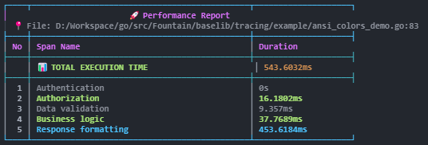

# 🚀 QuickTrace for Dart & Flutter

[](https://pub.dev/packages/quicktrace)
[](https://pub.dev/packages/quicktrace)
[](https://opensource.org/licenses/MIT)

A lightweight, colorful tracing library for **Dart** and **Flutter** with cross-platform safe colors and smart filtering capabilities.

**QuickTrace** giúp bạn debug và monitor performance một cách dễ dàng với output đẹp mắt và nhiều style khác nhau.


*Example of StyleColorful output showing performance tracing with color-coded timing*

## ✨ Features

- 🎨 **Cross-platform safe colors** - hoạt động tốt trên Windows, Linux, macOS
- 📊 **Multiple output styles** - Default, Colorful, Minimal, Detailed, Table, JSON
- 🔍 **Smart filtering** - Hide ultra-fast operations, show slow-only, group similar
- 📍 **Caller info** - Automatically capture file and line information  
- ⚡ **Zero-config** - Works out of the box with sensible defaults
- 🌍 **Multi-platform** - Works in Dart CLI, Flutter apps, và web applications

## 📦 Installation

Add this to your package's `pubspec.yaml` file:

```yaml
dependencies:
  quicktrace: ^1.0.0
```

Then run:

```bash
dart pub get
```

Or with Flutter:

```bash
flutter pub get
```

## 🚀 Quick Start

### Basic Example

```dart
import 'package:quicktrace/quicktrace.dart';

void main() async {
  final tracer = QuickTracer('API Call', 
      outputStyle: OutputStyle.styleColorful);
  
  tracer.span('Database query');
  await Future.delayed(Duration(milliseconds: 50));
  
  tracer.span('Process data');
  await Future.delayed(Duration(milliseconds: 20));
  
  tracer.span('Send response');
  await Future.delayed(Duration(milliseconds: 10));
  
  tracer.end(); // Automatically prints colorful output
}
```

### Flutter Integration

```dart
import 'package:flutter/material.dart';
import 'package:quicktrace/quicktrace.dart';

class MyWidget extends StatelessWidget {
  @override
  Widget build(BuildContext context) {
    return FutureBuilder<String>(
      future: _loadData(),
      builder: (context, snapshot) {
        if (snapshot.hasData) {
          return Text(snapshot.data!);
        }
        return CircularProgressIndicator();
      },
    );
  }

  Future<String> _loadData() async {
    final tracer = QuickTracer('Load Data',
        outputStyle: OutputStyle.styleMinimal,
        silent: true); // Silent in production
    
    tracer.span('Fetch from API');
    await Future.delayed(Duration(milliseconds: 100));
    
    tracer.span('Parse JSON');
    await Future.delayed(Duration(milliseconds: 20));
    
    tracer.span('Cache result');
    await Future.delayed(Duration(milliseconds: 5));
    
    tracer.end();
    
    // Access measurements programmatically
    final totalTime = tracer.totalDuration;
    print('Data loading took: $totalTime');
    
    return 'Loaded data';
  }
}
```

## 🎨 Output Styles

QuickTrace hỗ trợ 6 styles khác nhau:

| Style | Description | Use Case | Preview |
|-------|-------------|----------|---------|
| `OutputStyle.styleDefault` | Simple table format | General purpose | - |
| `OutputStyle.styleColorful` | Modern with Unicode borders | Development/Debug |  |
| `OutputStyle.styleMinimal` | Compact tree view | CI/CD logs |  |
| `OutputStyle.styleDetailed` | Full analysis with stats | Performance analysis |  |
| `OutputStyle.styleTable` | Clean table format | Reports |  |
| `OutputStyle.styleJson` | Structured JSON output | Integration/Parsing |  |

## ⚙️ Advanced Configuration

```dart
final tracer = QuickTracer(
  'Complex Operation',
  
  // Only show operations slower than 100ms
  showSlowOnly: Duration(milliseconds: 100),
  
  // Hide operations faster than 1ms
  hideUltraFast: Duration(milliseconds: 1),
  
  // Group similar duration operations
  groupSimilar: Duration(milliseconds: 10),
  
  // Custom output style
  outputStyle: OutputStyle.styleDetailed,
  
  // Only print if total duration >= 50ms
  minTotalDuration: Duration(milliseconds: 50),
  
  // Silent mode (collect data but don't print)
  silent: true,
  
  // Disable tracing completely
  enabled: false,
);
```

## 🔍 Smart Filtering

QuickTrace có các tính năng filtering thông minh:

- **Show Slow Only**: Chỉ hiển thị operations chậm hơn threshold
- **Hide Ultra Fast**: Ẩn operations quá nhanh (< 1ms)
- **Group Similar**: Nhóm operations có duration tương tự
- **Min Duration**: Chỉ print khi tổng thời gian >= threshold

### Filtering Example

```dart
final tracer = QuickTracer(
  'Smart Filtered Trace',
  outputStyle: OutputStyle.styleDetailed,
  showSlowOnly: Duration(milliseconds: 50),    // Show slow >= 50ms
  hideUltraFast: Duration(milliseconds: 2),    // Hide ultra fast < 2ms
  groupSimilar: Duration(milliseconds: 15),    // Group similar ±15ms
);
```

## 🎯 Color Rules

QuickTrace sử dụng color rules thông minh:

| Duration | Color | Category |
|----------|-------|----------|
| > 3s | Red Bold | Very Slow |
| 1s - 3s | Red | Slow |
| 500ms - 1s | Yellow | Medium-Slow |
| 200ms - 500ms | Bright Blue | Medium |
| 100ms - 200ms | Cyan | Normal |
| 50ms - 100ms | Green | Fast |
| 10ms - 50ms | Bright Green | Very Fast |
| < 10ms | Bright Black | Ultra Fast |

## 📊 Runtime Control

```dart
// Enable/disable tracing
tracer.setEnabled(false);

// Silent mode (collect data but don't print)
tracer.setSilent(true);

// Change style at runtime
tracer.setOutputStyle(OutputStyle.styleJson);

// Custom print condition
tracer.setPrintCondition((t) => t.totalDuration > Duration(milliseconds: 100));

// Get measurements programmatically
final measurements = tracer.measurements;
final totalDuration = tracer.totalDuration;
final isEnabled = tracer.isEnabled;
final isSilent = tracer.isSilent;
```

## 🌍 Platform Support

| Feature | Dart CLI | Flutter Mobile | Flutter Web | Flutter Desktop |
|---------|----------|----------------|-------------|-----------------|
| Basic Tracing | ✅ | ✅ | ✅ | ✅ |
| Color Output | ✅ | ✅ | ⚠️* | ✅ |
| Multiple Styles | ✅ | ✅ | ✅ | ✅ |
| Smart Filtering | ✅ | ✅ | ✅ | ✅ |
| Runtime Control | ✅ | ✅ | ✅ | ✅ |
| JSON Export | ✅ | ✅ | ✅ | ✅ |

*Web colors depend on browser console support

## 📁 Examples

Explore complete examples in the [example/](example/) directory:

- [`demo.dart`](example/demo.dart) - **Comprehensive showcase** (Recommended first)
- [`basic_example.dart`](example/basic_example.dart) - Basic usage
- [`advanced_example.dart`](example/advanced_example.dart) - Advanced filtering  
- [`styles_example.dart`](example/styles_example.dart) - All output styles
- [`filtering_example.dart`](example/filtering_example.dart) - Smart filtering demo
- [`runtime_control_example.dart`](example/runtime_control_example.dart) - Runtime control
- [`real_world_example.dart`](example/real_world_example.dart) - Realistic API scenarios

### 🚀 Running Examples

**Quick Start:**
```bash
# Navigate to package directory
cd dart

# Install dependencies
dart pub get

# Run comprehensive demo (recommended first)
dart run example/demo.dart
```

**Individual Examples:**
```bash
# Basic usage
dart run example/basic_example.dart

# All 6 output styles showcase
dart run example/styles_example.dart

# Smart filtering demonstration
dart run example/filtering_example.dart

# Runtime control features
dart run example/runtime_control_example.dart

# Real-world API server simulation
dart run example/real_world_example.dart

# Advanced filtering with detailed output
dart run example/advanced_example.dart
```

**Using Runner Scripts:**

On **Windows:**
```bash
# Interactive menu để chọn examples
run_examples.bat
```

On **Linux/macOS:**
```bash
# Make executable và chạy interactive menu
chmod +x run_examples.sh
./run_examples.sh
```

**Run All Examples:**
```bash
# Chạy tất cả examples liên tiếp
dart run example/demo.dart && \
dart run example/basic_example.dart && \
dart run example/styles_example.dart && \
dart run example/filtering_example.dart && \
dart run example/runtime_control_example.dart && \
dart run example/advanced_example.dart && \
dart run example/real_world_example.dart
```

**Testing:**
```bash
# Run unit tests
dart test

# Run tests với detailed output
dart test --reporter=expanded
```

### 🎨 Expected Output

Khi chạy examples, bạn sẽ thấy output đẹp với:

- **🌈 Colorful ANSI colors** - Duration-based color coding
- **📊 Unicode borders** - Modern table formatting với `┌─┐`, `╔═╗`
- **⏱️ Clean duration format** - `31.500ms`, `124.67ms`, `0s` (giống Go)
- **📈 Progress bars** - Visual indicators cho percentages
- **🔍 Smart filtering** - Noise reduction với grouping
- **📍 Caller information** - Automatic file:line capture

**Sample Output:**
```
┌──────────────────────────────────────────────────────────────┐
│                  🚀 API Request Processing                   │
├──────────────────────────────────────────────────────────────┤
│ ⏱️  Total Time:                     │ 299.40ms
├──────────────────────────────────────────────────────────────┤
│ 📋 Span                             │ ⏰ Duration
├──────────────────────────────────────────────────────────────┤
│ Authenticate user                   │ 1.0010ms
│ Query database                      │ 36.820ms  
│ Process business logic              │ 153.91ms
│ Generate response                   │ 90.881ms
└──────────────────────────────────────────────────────────────┘
```

## 🔧 Best Practices

### Development vs Production

```dart
// Development
final tracer = QuickTracer(
  'Debug Trace',
  outputStyle: OutputStyle.styleColorful,
  hideUltraFast: Duration(milliseconds: 1),
);

// Production  
final tracer = QuickTracer(
  'Production Trace',
  silent: true, // Don't print to console
  enabled: kDebugMode, // Only enable in debug mode
);

// Access data programmatically in production
final duration = tracer.totalDuration;
if (duration > Duration(seconds: 1)) {
  // Log slow operations to monitoring service
  analyticsService.logSlowOperation(tracer.measurements);
}
```

### Flutter Performance Monitoring

```dart
class PerformanceTracker {
  static QuickTracer? _currentTracer;
  
  static void startTrace(String name) {
    _currentTracer = QuickTracer(
      name,
      silent: !kDebugMode,
      outputStyle: OutputStyle.styleMinimal,
    );
  }
  
  static void addSpan(String operation) {
    _currentTracer?.span(operation);
  }
  
  static Duration? endTrace() {
    _currentTracer?.end();
    final duration = _currentTracer?.totalDuration;
    _currentTracer = null;
    return duration;
  }
}

// Usage in widgets
class MyApp extends StatelessWidget {
  @override
  Widget build(BuildContext context) {
    PerformanceTracker.startTrace('App Build');
    
    PerformanceTracker.addSpan('Theme initialization');
    final theme = MyTheme.create();
    
    PerformanceTracker.addSpan('MaterialApp creation');
    final app = MaterialApp(theme: theme, home: HomePage());
    
    final buildTime = PerformanceTracker.endTrace();
    
    return app;
  }
}
```

## 🤝 Contributing

1. Fork the repository
2. Create feature branch (`git checkout -b feature/amazing-feature`)
3. Commit changes (`git commit -am 'Add amazing feature'`)
4. Push to branch (`git push origin feature/amazing-feature`)
5. Open a Pull Request

## 📝 License

This project is licensed under the MIT License - see the [LICENSE](../LICENSE) file for details.

## 🙏 Acknowledgments

- Inspired by modern development tools
- Built with cross-platform compatibility in mind
- Community feedback and contributions

---

**Made with ❤️ for Dart & Flutter developers who love beautiful, functional tracing tools.** 
