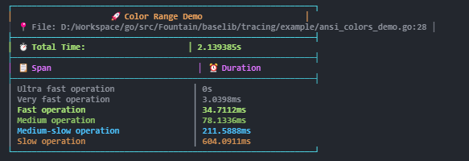

# 🚀 QuickTrace for Java

Một thư viện tracing nhẹ, đầy màu sắc cho Java với smart filtering capabilities và cross-platform color support.



*Ví dụ hiển thị StyleColorful output với performance analysis*

## 📦 Installation

### Maven

```xml
<dependency>
    <groupId>com.leduy</groupId>
    <artifactId>quicktrace</artifactId>
    <version>1.0.0</version>
</dependency>
```

### Gradle

```gradle
implementation 'com.leduy:quicktrace:1.0.0'
```

## 🚀 Quick Start

```java
import com.leduy.quicktrace.Tracer;
import com.leduy.quicktrace.OutputStyle;

public class Example {
    public static void main(String[] args) throws InterruptedException {
        Tracer tracer = Tracer.builder("API Call")
                .outputStyle(OutputStyle.COLORFUL)
                .build();
        
        tracer.span("Database query");
        Thread.sleep(50);
        
        tracer.span("Process data");
        Thread.sleep(20);
        
        tracer.span("Send response");
        Thread.sleep(10);
        
        tracer.end(); // Automatically prints colorful output
    }
}
```

## ⚙️ Configuration Options

```java
Tracer tracer = Tracer.builder("Complex Operation")
    // Chỉ hiển thị operations chậm hơn 100ms
    .showSlowOnly(Duration.ofMillis(100))
    
    // Ẩn operations nhanh hơn 1ms
    .hideUltraFast(Duration.ofMillis(1))
    
    // Nhóm operations có duration tương tự
    .groupSimilar(Duration.ofMillis(10))
    
    // Custom output style
    .outputStyle(OutputStyle.DETAILED)
    
    // Chỉ print nếu tổng duration >= 50ms
    .minTotalDuration(Duration.ofMillis(50))
    
    // Silent mode (thu thập data nhưng không print)
    .silent(true)
    
    // Tắt tracing hoàn toàn
    .enabled(false)
    
    .build();
```

## 🎨 Output Styles

- `OutputStyle.DEFAULT` - Simple table format
- `OutputStyle.COLORFUL` - Modern với Unicode borders  
- `OutputStyle.MINIMAL` - Compact tree view
- `OutputStyle.DETAILED` - Full analysis với statistics
- `OutputStyle.TABLE` - Clean table format
- `OutputStyle.JSON` - Structured JSON output

## 📊 Runtime Control

```java
// Enable/disable tracing
tracer.setEnabled(false);

// Silent mode (thu thập data nhưng không print)
tracer.setSilent(true);

// Thay đổi style tại runtime
tracer.setOutputStyle(OutputStyle.JSON);

// Custom print condition
tracer.setPrintCondition(t -> 
    t.getTotalDuration().compareTo(Duration.ofMillis(100)) > 0);

// Lấy measurements programmatically
List<Measurement> measurements = tracer.getMeasurements();
Duration totalDuration = tracer.getTotalDuration();
```

## 🔍 Smart Filtering

QuickTrace bao gồm intelligent filtering để giảm noise:

- **Show Slow Only**: `showSlowOnly(threshold)` - Chỉ hiển thị operations chậm hơn threshold
- **Hide Ultra Fast**: `hideUltraFast(threshold)` - Ẩn operations nhanh hơn threshold  
- **Group Similar**: `groupSimilar(threshold)` - Nhóm operations có durations tương tự
- **Smart Filter**: `smartFilter(slow, ultraFast, similar)` - Kết hợp tất cả filters

```java
Tracer tracer = Tracer.builder("Smart Filtering Example")
    .smartFilter(
        Duration.ofMillis(50),  // Show slow >= 50ms
        Duration.ofMillis(2),   // Hide ultra fast < 2ms
        Duration.ofMillis(15))  // Group similar ±15ms
    .build();
```

## 🎯 Color Rules

| Duration | Color | Category |
|----------|-------|----------|
| > 3s | Red Bold | Very Slow |
| 1s - 3s | Red | Slow |
| 500ms - 1s | Yellow | Medium-Slow |
| 200ms - 500ms | Bright Blue | Medium |
| 100ms - 200ms | Cyan | Normal |
| 50ms - 100ms | Green | Fast |
| 10ms - 50ms | Bright Green | Very Fast |
| < 10ms | Bright Black | Ultra Fast |

## 📍 Caller Information

QuickTrace tự động capture file và line information nơi tracer được tạo:

```java
Tracer tracer = Tracer.newSimpleTracer("My Function"); 
// Sẽ hiển thị: MyFile.java:123 trong output
```

## 📝 Advanced Examples

### Basic Usage

```java
public class BasicExample {
    public static void main(String[] args) throws InterruptedException {
        Tracer tracer = Tracer.newSimpleTracer("Basic Example");
        
        tracer.span("Initialize database");
        Thread.sleep(30);
        
        tracer.span("Load user data");
        Thread.sleep(50);
        
        tracer.end();
    }
}
```

### Advanced Filtering

```java
public class AdvancedExample {
    public static void main(String[] args) throws InterruptedException {
        Tracer tracer = Tracer.builder("Advanced Example")
                .outputStyle(OutputStyle.DETAILED)
                .hideUltraFast(Duration.ofMillis(1))
                .showSlowOnly(Duration.ofMillis(10))
                .groupSimilar(Duration.ofMillis(5))
                .build();
        
        tracer.span("Connect to database");
        Thread.sleep(100);
        
        tracer.span("Execute query 1");
        Thread.sleep(45);
        
        tracer.span("Execute query 2");
        Thread.sleep(50); // Similar to query 1
        
        tracer.end();
    }
}
```

### Runtime Control

```java
public class RuntimeExample {
    public static void main(String[] args) throws InterruptedException {
        Tracer tracer = Tracer.newSimpleTracer("Runtime Control");
        
        // Enable tracing
        tracer.span("Operation 1");
        Thread.sleep(20);
        
        // Disable tracing
        tracer.setEnabled(false);
        tracer.span("Operation 2"); // Won't be recorded
        
        // Enable again
        tracer.setEnabled(true);
        tracer.span("Operation 3");
        Thread.sleep(30);
        
        tracer.end();
    }
}
```

## 🚀 Chạy Examples

### Quick Start - Chạy ngay các examples

```bash
# Di chuyển vào thư mục Java
cd java

# Compile project
mvn compile

# Chạy basic example (với Detailed style như Go version)
mvn exec:java -Dexec.mainClass="com.leduy.quicktrace.examples.BasicExample" -q

# Chạy advanced example với smart filtering
mvn exec:java -Dexec.mainClass="com.leduy.quicktrace.examples.AdvancedExample" -q

# Demo tất cả các output styles
mvn exec:java -Dexec.mainClass="com.leduy.quicktrace.examples.StylesExample" -q

# Demo smart filtering capabilities
mvn exec:java -Dexec.mainClass="com.leduy.quicktrace.examples.FilteringExample" -q

# Demo runtime control features
mvn exec:java -Dexec.mainClass="com.leduy.quicktrace.examples.RuntimeControlExample" -q

# Quick demo với các style khác nhau
mvn exec:java -Dexec.mainClass="com.leduy.quicktrace.examples.QuickDemo" -Dexec.args="JSON" -q
mvn exec:java -Dexec.mainClass="com.leduy.quicktrace.examples.QuickDemo" -Dexec.args="COLORFUL" -q
mvn exec:java -Dexec.mainClass="com.leduy.quicktrace.examples.QuickDemo" -Dexec.args="TABLE" -q
```

### Sử dụng Build Scripts

**Windows:**
```cmd
cd java
build.bat
```

**Linux/macOS:**
```bash
cd java
chmod +x build.sh
./build.sh
```

### Examples Available

| Example | Description | Features Demonstrated |
|---------|-------------|----------------------|
| `BasicExample` | Usage cơ bản với Detailed style | Core tracing, Unicode borders, statistics |
| `AdvancedExample` | Smart filtering demonstration | hideUltraFast, showSlowOnly, groupSimilar |
| `StylesExample` | Tất cả 6 output styles | Default, Colorful, Minimal, Detailed, Table, JSON |
| `FilteringExample` | Chi tiết về filtering capabilities | Multiple filtering scenarios |
| `RuntimeControlExample` | Runtime control features | Enable/disable, silent mode, dynamic styles |
| `QuickDemo` | Quick demo với style parameters | Parameterized style selection |

### Expected Output

**BasicExample (Detailed Style):**
```
╔══════════════════════════════════════════════════════════════════════════════╗
║                           🎯 TRACE: Basic Example                           ║ 
╠══════════════════════════════════════════════════════════════════════════════╣
║ 📊 SUMMARY                                                                   ║ 
║ • Total Execution Time: PT0.1130822S                                         ║
║ • Number of Spans: 4                                                         ║
║ • Slowest Operation: Process data                                            ║
║ • Slowest Duration: PT0.0508818S                                             ║
║ • File: BasicExample.java:15                                                 ║
╠══════════════════════════════════════════════════════════════════════════════╣
║ 🔍 DETAILED BREAKDOWN                                                         ║
╟──────────────────────────────────────────────────────────────────────────────╢
║   # │ Operation                     │       Duration │ Percent │ Progress    ║
╟──────────────────────────────────────────────────────────────────────────────╢
║   1 │ Initialize database           │          PT0S │   0,0% │ ░░░░░░░░░░░ ║  
║   2 │ Load user data                │   PT0.031553S │  27,9% │ ███░░░░░░░░ ║  
║   3 │ Process data                  │  PT0.0508818S │  45,0% │ █████░░░░░░ ║  
║   4 │ Generate response             │  PT0.0201398S │  17,8% │ ██░░░░░░░░░ ║  
╚══════════════════════════════════════════════════════════════════════════════╝
```

**AdvancedExample (Smart Filtering):**
```
╔══════════════════════════════════════════════════════════════════════════════╗
║                          🎯 TRACE: Advanced Example                          ║ 
╠══════════════════════════════════════════════════════════════════════════════╣
║ 📊 SUMMARY                                                                   ║ 
║ • Total Execution Time: PT0.4392151S                                         ║
║ • Number of Spans: 7                                                         ║
║ • Slowest Operation: Send notification                                       ║
║ • Slowest Duration: PT0.2008141S                                             ║
╠══════════════════════════════════════════════════════════════════════════════╣
║ 🔍 DETAILED BREAKDOWN                                                         ║
╟──────────────────────────────────────────────────────────────────────────────╢
║   # │ Operation                     │       Duration │ Percent │ Progress    ║
╟──────────────────────────────────────────────────────────────────────────────╢
║   1 │ 📦 Execute query 1            │   PT0.101006S │  23,0% │ ██░░░░░░░░░ ║   
║   2 │ 📦 Execute query 2            │  PT0.0451282S │  10,3% │ █░░░░░░░░░░ ║   
║   3 │ 📦 Cache result               │  PT0.0507054S │  11,5% │ █░░░░░░░░░░ ║   
║   4 │ 📦 Send notification          │  PT0.2008141S │  45,7% │ █████░░░░░░ ║   
╟──────────────────────────────────────────────────────────────────────────────╢
║ 🔍 Filtered: 4/7 spans | Active: slow>PT0.01S, hide<PT0.001S, group±PT0.005S ║ 
╚══════════════════════════════════════════════════════════════════════════════╝
```

## 🔧 Building from Source

```bash
# Clone repository
git clone https://github.com/LeDuyViet/quicktrace.git
cd quicktrace/java

# Build với Maven
mvn clean install

# Package JAR file
mvn package
```

## 🧪 Testing

```bash
# Run tests
mvn test

# Run với coverage
mvn test jacoco:report
```

## 🌐 Cross-Platform Support

QuickTrace được tối ưu hóa cho cross-platform compatibility:

- ✅ Windows Command Prompt
- ✅ Windows PowerShell  
- ✅ Linux Terminal
- ✅ macOS Terminal
- ✅ IntelliJ IDEA Console
- ✅ Eclipse Console
- ✅ VS Code Terminal

## 📚 Documentation

- [Basic Examples](src/main/java/com/leduy/quicktrace/examples/BasicExample.java)
- [Advanced Examples](src/main/java/com/leduy/quicktrace/examples/AdvancedExample.java)
- [Style Examples](src/main/java/com/leduy/quicktrace/examples/StylesExample.java)
- [Filtering Examples](src/main/java/com/leduy/quicktrace/examples/FilteringExample.java)
- [Runtime Control Examples](src/main/java/com/leduy/quicktrace/examples/RuntimeControlExample.java)

## 🤝 Contributing

1. Fork repository
2. Tạo feature branch (`git checkout -b feature/amazing-feature`)
3. Commit changes (`git commit -m 'Add amazing feature'`)
4. Push to branch (`git push origin feature/amazing-feature`)
5. Mở Pull Request

## 📝 License

MIT License - xem [LICENSE](../LICENSE) file để biết thêm chi tiết.

## 🔗 Related Projects

- [QuickTrace Go](../go/) - Go implementation
- [QuickTrace Dart](../dart/) - Dart/Flutter implementation  
- [QuickTrace JavaScript](../js/) - JavaScript/Node.js implementation
